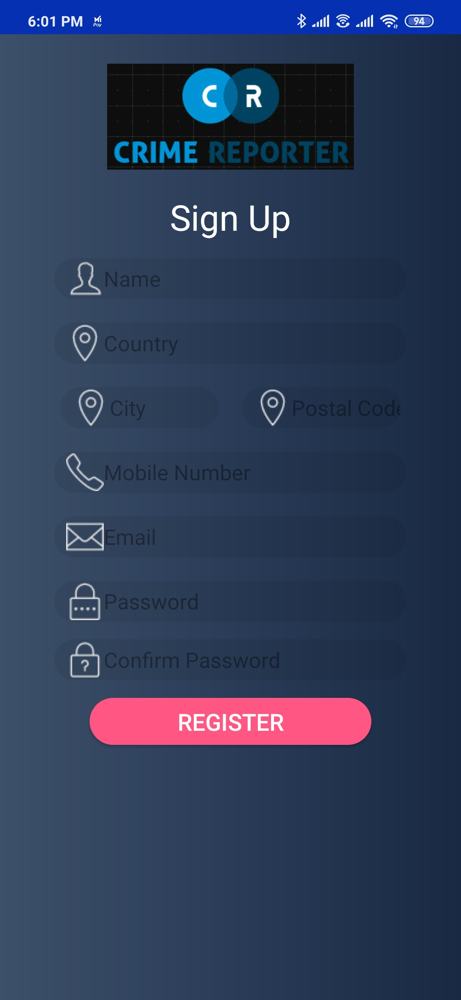
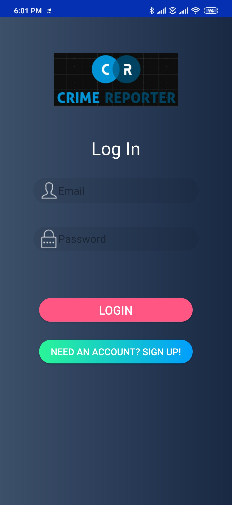
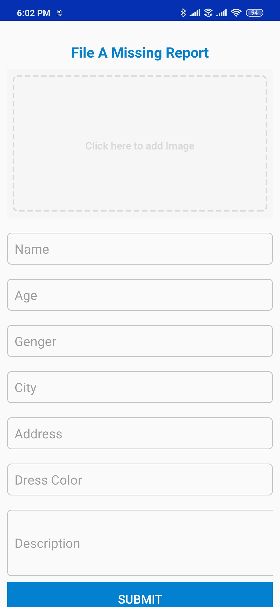
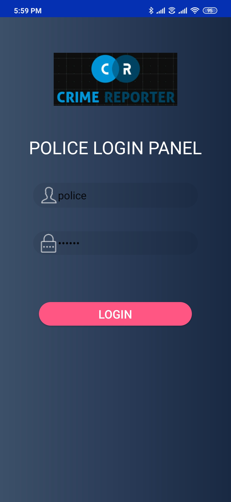
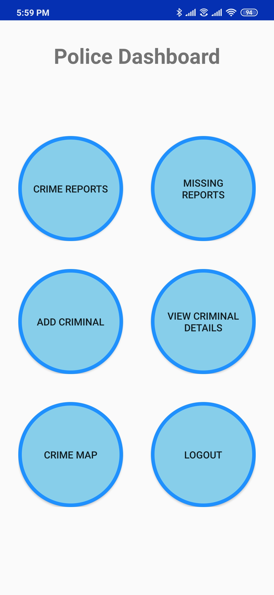
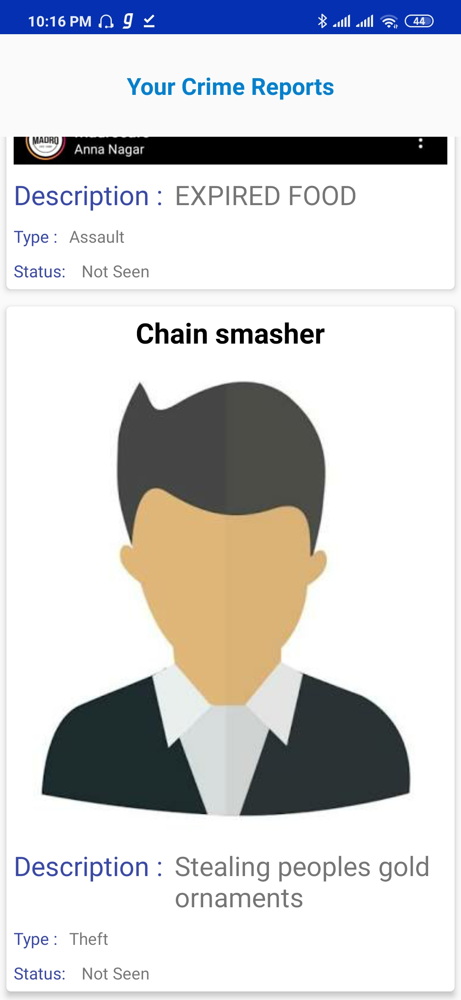
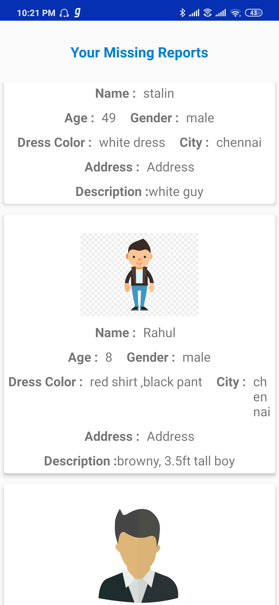
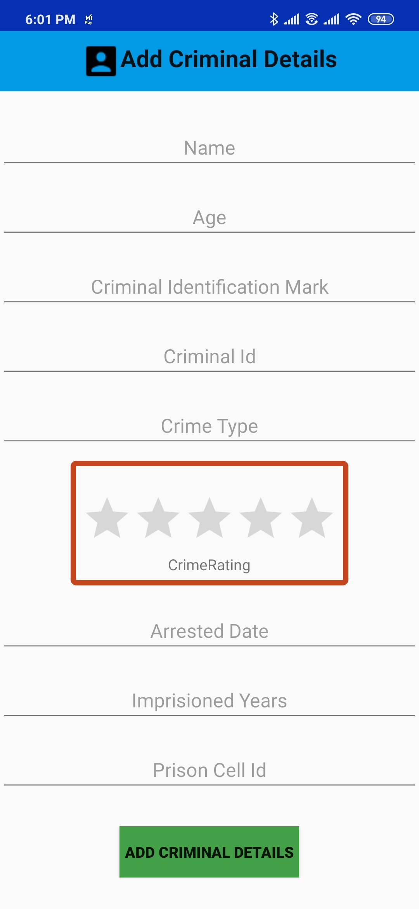
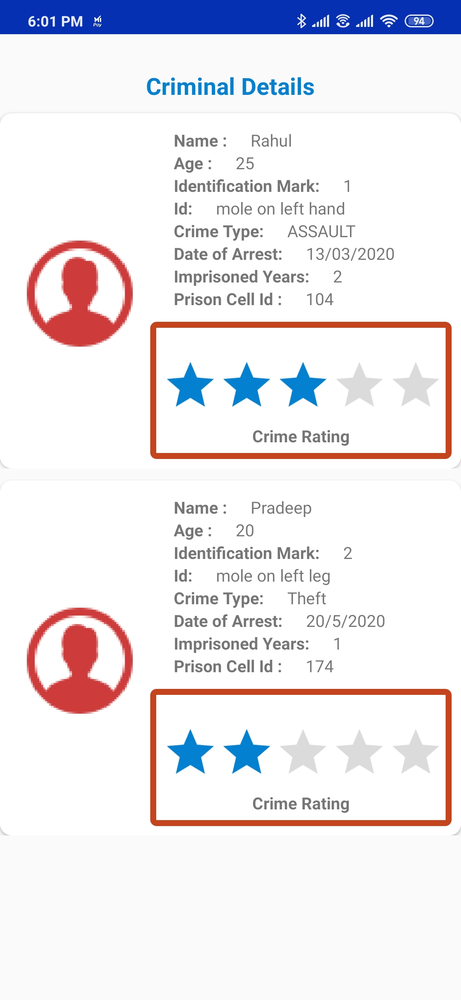

# Crime-Report-Management-System
A Ready to release **Android application for Criminal Report Management System**.

<p align="center">

</p>

## Abstract
Criminal Report Management System is an android application designed to **Report Crime or Person Missing Case** 
and **Ease of Maintaining Criminal Records** through cloud database.

## Types of Users
```diff
1. Public People
2. Police Authority
```

## Features
**Public People can:**
```diff
1. Report Crime
2. File Person Missing Case
3. View or Edit User Information
```

**Police Authority can:**
```diff
1. View Crime Reports/Cases
2. View Person Missing Cases
3. View Crime Spots on Google Map
4. Add Criminal Record/Detail
5. View Criminal Record
```


## Technology Stack

This system is an Android based mobile application that uses **Firebase** as a **Cloud database**. The Android application here is developed using famous programming language **Java**
and the **UI** is designed using **XML** (Extendible Markup Language).

#### Tools:
```diff
1. Android Studio IDE
2. Firebase Authentication & Database
3. Adobe XD
```

#### Languages:
```diff
1. XML
2. Java
```

#### You can Reach me at [partheebansms@gmail.com](mailto:partheebansms@gmail.com)

## Application Snapshots

<p align="center">
















#### You can Reach me at [partheebansms@gmail.com](mailto:partheebansms@gmail.com)
</p>
